# n8n on AWS with Terraform

[](https://www.terraform.io/)
[](https://aws.amazon.com/)
[](https://n8n.io/)
[](https://opensource.org/licenses/MIT)

> **Production-ready n8n deployment on AWS with CloudFront CDN, ECS Fargate, and interactive version management**

This repository contains Terraform infrastructure code to deploy [n8n](https://n8n.io/) (a workflow automation platform) on AWS with global CDN distribution via CloudFront. The deployment includes automated version checking, security best practices, and cost optimization features.

## 🏗️ What This Does

This Terraform configuration creates a complete, production-ready n8n deployment on AWS with the following architecture:

### AWS Resources Created

1. **n8n Application Stack** (via [elasticscale/n8n/aws](https://registry.terraform.io/modules/elasticscale/n8n/aws/latest) module):
   - **ECS Fargate Cluster** - Runs n8n containers without managing servers
   - **Application Load Balancer (ALB)** - Distributes traffic to n8n instances
   - **RDS PostgreSQL Database** - Stores n8n workflows and execution data
   - **VPC & Security Groups** - Secure network isolation
   - **EFS Storage** - Persistent file storage for n8n data

2. **CloudFront Distribution** - Global CDN for improved performance and HTTPS termination

### Architecture Overview

```mermaid
graph TB
    Users[👥 Users] --> CF[☁️ CloudFront Distribution]
    CF --> ALB[⚖️ Application Load Balancer]
    ALB --> ECS[🐳 ECS Fargate Tasks]
    ECS --> EFS[💾 EFS Storage]
    
    subgraph "AWS Account"
        subgraph "VPC"
            subgraph "Public Subnets"
                ALB
            end
            subgraph "Private Subnets"
                ECS
                EFS
            end
        end
        CF
    end
    
    style CF fill:#ff9900
    style ALB fill:#4CAF50
    style ECS fill:#2196F3
    style EFS fill:#9C27B0
```



### How It Works

1. **Users** access n8n through a CloudFront URL (automatically HTTPS)
2. **CloudFront** caches static content and forwards requests to the ALB
3. **Application Load Balancer** distributes traffic to healthy n8n containers
4. **ECS Fargate** runs n8n containers without server management
5. **EFS Storage** provides persistent file storage for n8n workflows and data

## 🚀 Quick Start

### Prerequisites

- [Terraform](https://www.terraform.io/downloads.html) >= 1.0
- [AWS CLI](https://aws.amazon.com/cli/) configured with appropriate credentials
- AWS account with permissions to create VPCs, ECS, RDS, CloudFront, etc.
- `curl` and `jq` (for version checking script)

### Deployment Steps

1. **Clone this repository**:
   ```bash
   git clone <repository-url>
   cd tf-aws-n8n
   ```

2. **Initialize Terraform**:
   ```bash
   terraform init
   ```

3. **Review and customize variables** (optional):
   ```bash
   # Edit variables.tf or create terraform.tfvars
   cp terraform.tfvars.example terraform.tfvars
   ```

4. **Deploy with version checking** (recommended):
   ```bash
   # Make the script executable (first time only)
   chmod +x deploy.sh
   
   # Deploy with interactive version checking
   ./deploy.sh
   ```
   
   **⚠️ Important**: Use `./deploy.sh` for version prompts, not `terraform apply`
   
   Or use traditional Terraform commands (no version checking):
   ```bash
   terraform plan
   terraform apply
   ```

5. **Access n8n**:
   After deployment, you'll get the CloudFront URL. n8n will be accessible at:
   ```
   https://<cloudfront-domain>.cloudfront.net
   ```

### First Time Setup

1. **Wait for propagation**: CloudFront distribution takes 10-15 minutes to fully deploy
2. **Create account**: Visit the URL and create your first n8n account
3. **Configure workflows**: Start building your automation workflows!

## ⚙️ Configuration

### Variables

| Variable | Description | Default | Type |
|----------|-------------|---------|------|
| `aws_region` | AWS region to deploy into | `eu-central-1` | string |
| `desired_count` | Number of n8n Fargate tasks | `1` | number |

### Customization

You can customize the deployment by:

1. **Changing the AWS region**: Modify `aws_region` in `variables.tf`
2. **Scaling n8n instances**: Adjust `desired_count` for high availability
3. **Adding SSL certificate**: Uncomment and configure `certificate_arn` in `n8n.tf`

## 🔧 Architecture Details

### Security Features

```mermaid
graph LR
    Internet[🌐 Internet] --> CF[☁️ CloudFront]
    CF --> ALB[⚖️ ALB]
    ALB --> ECS[🐳 ECS Tasks]
    
    subgraph "Security Layers"
        CF --> SSL[🔒 HTTPS Only]
        ALB --> SG[🛡️ Security Groups]
        ECS --> VPC[🏠 Private Subnets]
    end
    
    style SSL fill:#4CAF50
    style SG fill:#2196F3
    style VPC fill:#9C27B0
```



- **Private subnets** for application containers
- **Security groups** restricting access to necessary ports only
- **HTTPS enforcement** via CloudFront
- **VPC isolation** separating your infrastructure from other AWS resources
- **CloudFront protection** - ALB only accessible via CloudFront

### Cost Optimization

- **Fargate** charges only for actual compute time
- **CloudFront** reduces origin load and improves global performance
- **EFS** provides cost-effective persistent storage
- **Spot instances** reduce compute costs by up to 70%

## 📋 Outputs

After deployment, you'll get:

- `cloudfront_domain` - The CloudFront domain name (e.g., `d2ncljfl0rf1ql.cloudfront.net`)
- `n8n_url` - The complete HTTPS URL for accessing n8n

## 🛠️ Maintenance

### Scaling

To change the number of n8n instances:
```bash
terraform apply -var="desired_count=2"
```

### Updates

#### Automatic Version Checking (Recommended)


Use the deployment script for interactive version management:
```bash
./deploy.sh
```

This script will:
- Check your current n8n version
- Compare with the latest available version
- Prompt you to upgrade or stay with current version
- Deploy your choice automatically

#### Manual Updates
To manually update the n8n version:
1. Edit the `container_image` version in `n8n.tf`
2. Run deployment:
   ```bash
   # For version checking
   ./deploy.sh
   
   # Or traditional way (no version checking)
   terraform plan
   terraform apply
   ```

### Factory Reset

To completely reset n8n (removes all data):
```bash
terraform destroy
terraform apply
```

**⚠️ Warning**: This will delete all workflows, executions, and user data!

### Monitoring

The elasticscale module includes:
- CloudWatch logs for application monitoring
- ALB health checks for container health
- Auto-scaling capabilities

## 🔗 Important Resources

### Documentation
- [n8n Documentation](https://docs.n8n.io/)
- [AWS ECS Fargate Documentation](https://docs.aws.amazon.com/AmazonECS/latest/developerguide/AWS_Fargate.html)
- [AWS CloudFront Documentation](https://docs.aws.amazon.com/cloudfront/)
- [Terraform AWS Provider](https://registry.terraform.io/providers/hashicorp/aws/latest/docs)

### Modules Used
- [elasticscale/n8n/aws](https://registry.terraform.io/modules/elasticscale/n8n/aws/latest) - Main n8n deployment module

### AWS Services
- [Amazon ECS](https://aws.amazon.com/ecs/) - Container orchestration
- [AWS Fargate](https://aws.amazon.com/fargate/) - Serverless compute for containers
- [Amazon EFS](https://aws.amazon.com/efs/) - Elastic file system for persistent storage
- [Amazon CloudFront](https://aws.amazon.com/cloudfront/) - Global content delivery network
- [Application Load Balancer](https://aws.amazon.com/elasticloadbalancing/application-load-balancer/) - Layer 7 load balancing

## 📁 Project Structure

```
tf-aws-n8n/
├── 📄 README.md              # This documentation
├── 📄 LICENSE                # MIT license
├── 📄 .gitignore             # Git ignore rules
├── 🔧 providers.tf           # Terraform provider configuration
├── 📊 variables.tf           # Input variables
├── 📤 outputs.tf             # Output values
├── 🏗️ n8n.tf                 # Main n8n module configuration
├── ☁️ cloudfront.tf          # CloudFront distribution
├── 🛡️ security.tf            # Security configurations
└── 🚀 deploy.sh              # Deployment script with version checking
```

## 🚨 Important Notes

- **Initial setup time**: First deployment takes ~10-15 minutes
- **CloudFront propagation**: Additional 10-15 minutes for global distribution
- **Database**: Uses EFS for persistence (not RDS in this configuration)
- **Backups**: Consider implementing backup strategies for production use
- **SSL**: This setup uses CloudFront's default certificate. For custom domains, you'll need to configure SSL certificates
- **Costs**: This setup incurs costs for ECS, EFS, ALB, and CloudFront usage (varies by region and usage)
- **Version management**: Use `./deploy.sh` for interactive n8n version updates
- **Security**: ALB is accessible via CloudFront only, direct access is restricted

## 🤝 Contributing

1. Fork the repository
2. Create a feature branch
3. Make your changes
4. Submit a pull request

## 📄 License

This project is licensed under the MIT License - see the [LICENSE](LICENSE) file for details.

## 🆘 Support

- [n8n Community](https://community.n8n.io/)
- [AWS Support](https://aws.amazon.com/support/)
- [Terraform Community](https://discuss.hashicorp.com/c/terraform-core/27)

---

## 📋 Summary

This Terraform project provides a **production-ready n8n deployment** on AWS with:

✅ **Global CDN** - CloudFront distribution for performance  
✅ **Auto-scaling** - ECS Fargate with configurable instance count  
✅ **Persistent Storage** - EFS for workflow data  
✅ **HTTPS Security** - Automatic SSL/TLS termination  
✅ **Version Management** - Interactive upgrade script  
✅ **Cost Optimized** - Uses Spot instances and efficient resource allocation  

Perfect for teams wanting reliable n8n automation without the complexity of manual server management.

**Note**: This is a basic setup suitable for development and small production workloads. For enterprise use, consider additional security hardening, monitoring, and backup strategies.